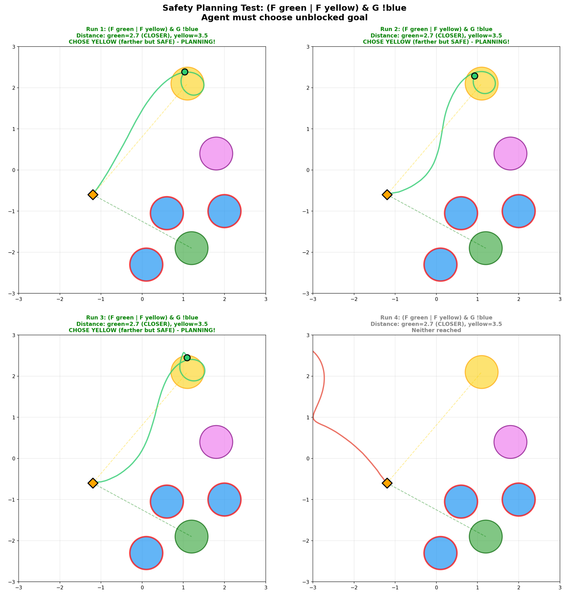

# World Model vs Behavioral Heuristics in DeepLTL

**Research Question**: Does the DeepLTL agent learn an internal world model for planning, or just behavioral heuristics that produce agent-like behavior without genuine multi-step reasoning?

## Summary

| Planning Type | Task | Result | Mechanism |
|--------------|------|--------|-----------|
| **Local** (safety) | Choose unblocked goal | 80% correct | Pattern recognition |
| **Global** (optimality) | Choose intermediate goal minimizing total path | 10% correct | Would require world model |

**Key finding**: The agent succeeds at local planning (reactive pattern matching) but fails at global planning (requires simulating future states). Probing confirms strong encoding of immediate features but weak encoding of computed/chained distances.

---

## Background: Local vs Global Planning

| Planning Type | Definition | Example | Requires World Model? |
|--------------|------------|---------|----------------------|
| **Local** | Sequential navigation through goals | "Go to A, then B" | No - reactive heuristics sufficient |
| **Global** | Choosing between options based on downstream consequences | "Choose A1 or A2 based on which makes reaching B easier" | Yes - must simulate future states |

**Hypothesis**: If the agent has only behavioral heuristics (not a world model), it should succeed at local planning but fail at global planning.

---

## Experiment 1: Safety Planning (Local)

**Task**: `(F green | F yellow) & G !blue`
- Choose between green and yellow goals
- One goal is blocked by a blue zone (which must be avoided)
- Agent must detect the blocking and choose the unblocked goal

### Results: 80% Correct



The agent successfully identifies when a goal is blocked and redirects to the alternative. This works because blocking detection is **perceptual** - it's a pattern in the current observation (obstacle between agent and goal), not a simulation of future states.

---

## Experiment 2: Optimality Planning (Global)

**Task**: `F blue THEN F green`
- Must reach a blue zone first, then reach green
- Two blue zones available with different strategic values
- **Optimal choice**: Blue closer to green (minimizes total path)
- **Myopic choice**: Blue closer to agent (greedy)

### Configuration

```
Agent start: (0.2, 0.2)
Blue1: (-0.8, -1.0)  ← closer to green (OPTIMAL)
Blue2: (1.0, 1.0)    ← closer to agent (MYOPIC)
Green: (-1.4, -1.9)

Optimal path: agent → blue1 → green = 2.64 total distance
Myopic path:  agent → blue2 → green = 4.89 total distance
```

### Results: 10% Optimal, 90% Myopic


The agent consistently chooses the closer blue zone, ignoring that this leads to a much longer total path. Task success rate is only 25% because the myopic choice often leads to timeout.

**Why this fails**: Choosing optimally requires computing chained distances:
- d(agent → blue1) + d(blue1 → green) vs
- d(agent → blue2) + d(blue2 → green)

This requires simulating "if I go to blue1, where will I be, and how far to green from there?" - a world model capability the agent lacks.

---

## Experiment 3: Controlling for Directional Bias

**Question**: Is the 10% optimal rate due to partial planning ability, or just coincidence?

**Setup**: Both blues placed equidistant from the agent. If the agent plans, it should choose blue closer to green. If it has a directional bias, it should show consistent preference regardless of optimality.

### Results

| Configuration | Optimal Blue Location | Agent's Choice | "Optimal" Rate |
|--------------|----------------------|----------------|----------------|
| Original | Lower-left | Upper-right (95%) | 5% |
| Swapped (green moved) | Upper-right | Upper-right (95%) | 95% |

The agent goes upper-right ~95% of the time regardless of which blue is optimal. Any apparent "optimal" behavior is coincidental alignment with this directional bias, not planning.

---

## Experiment 4: Probing for Planning Representations

We trained linear probes to decode information from model activations during task execution.


### What the Agent Encodes

| Feature | Performance | Interpretation |
|---------|-------------|----------------|
| Distance to each zone | R² = 0.74-0.93 | **Strong** - knows where things are |
| Blocking detection | 95% accuracy | **Strong** - explains safety success |
| Blue → Green distance | R² = 0.34-0.48 | **Weak** - doesn't compute |
| Total path via each blue | R² = 0.36-0.51 | **Weak** - no chained distances |

**Key Finding**: The model strongly encodes **immediate spatial features** (distances from self, blocking patterns) but weakly encodes **computed/relational features** (distances between other objects, chained path lengths).

---

## Analysis: Why Safety Works but Optimality Fails

### Safety Planning (Works)

```
Observation → "obstacle pattern between me and goal" → turn to other goal
```

- **Type**: Pattern recognition (perceptual)
- **Requires**: Detecting spatial configuration in current observation
- **World model needed**: No

### Optimality Planning (Fails)

```
Would need: "If I go to blue1, where will I be? From there, how far to green?"
```

- **Type**: Future simulation (computational)
- **Requires**: Simulating state transitions, computing distances from hypothetical positions
- **World model needed**: Yes

---

## Conclusion

The DeepLTL agent exhibits exactly the pattern predicted by the "fake agents" hypothesis:

| Capability | Result | Mechanism |
|------------|--------|-----------|
| Local planning (safety) | 80% success | Pattern recognition in observation |
| Global planning (optimality) | 10% success | Would require world model |
| Apparent optimal choices | Directional bias | Behavioral heuristic, not planning |

**The agent has behavioral heuristics, not a world model.** It learns reactive patterns that look like planning for local tasks but fails when genuine multi-step reasoning (simulating futures, comparing counterfactuals) is required.

---

## Experiment 5: Training on Hard Optimality Maps

**Question**: Can we induce planning by training on environments where myopic behavior leads to much longer paths?

**Setup**: Created 4 "hard optimality" map configurations where:
- Each color has 2 zones at strategic positions
- Myopic choice leads to 24-81% longer total paths
- All 4 colors (green, yellow, blue, magenta) used with random color pair selection
- Fine-tuned from existing agent for 2M steps

### Results: Improved Robustness, NOT Planning

| Metric | Before Training | After Training |
|--------|-----------------|----------------|
| Task Success Rate | 30% | **100%** |
| Optimal Choice Rate | 20% | 20% |
| Myopic Choice Rate | 80% | **80%** |
| Episode Length | 240 steps | 122 steps |

The agent learned to complete tasks faster and more reliably, but its planning behavior didn't change at all.

### Probing: Representations Unchanged

| Feature | Before Training (R²) | After Training (R²) |
|---------|---------------------|---------------------|
| Chained distance (total via blue) | 0.438 | 0.367 |
| Blue → Green distance | 0.226 | 0.207 |
| Nearest goal distance | 0.765 | 0.776 |

The chained distance encoding actually got **slightly worse** after training, not better.

### Interpretation

**Training on hard environments doesn't induce planning.** The agent found an alternative optimization path:
- Became faster at executing its existing (myopic) strategy
- Improved robustness/success rate through better reactive behavior
- Did NOT develop chained distance computation

This is a significant negative result: **pure environment difficulty is not sufficient to induce planning representations**. The RL objective (task success) can be satisfied without learning true planning capabilities. The network found a way to improve returns without developing the representations we hypothesized were necessary.

---

## Conclusion

The DeepLTL agent exhibits exactly the pattern predicted by the "fake agents" hypothesis:

| Capability | Result | Mechanism |
|------------|--------|-----------|
| Local planning (safety) | 80% success | Pattern recognition in observation |
| Global planning (optimality) | 10% success | Would require world model |
| Apparent optimal choices | Directional bias | Behavioral heuristic, not planning |
| **After hard training** | **Still 80% myopic** | **Robustness improved, planning didn't** |

**The agent has behavioral heuristics, not a world model.** Training on harder environments improves robustness but doesn't induce genuine planning capabilities. The network learns reactive patterns that look like planning for local tasks but fails when genuine multi-step reasoning is required - and this failure persists even after targeted training.

---

## Implications for Interpretability

1. **Planning is not emergent from task success**: Even when optimal planning would help, RL finds alternative solutions
2. **Representations must be explicitly incentivized**: Chained distances won't emerge just because they'd be useful
3. **Behavioral testing alone is insufficient**: The agent improved on metrics (success rate, episode length) without developing the target capability

### Potential Next Steps

1. **Explicit auxiliary losses** for chained distance prediction
2. **Path-length penalties** in the reward function (incentivize efficiency, not just success)
3. **Architecture changes** that force distance computation through specific pathways

---

## Files Reference

| File | Purpose |
|------|---------|
| `paper_safety_test.py` | Safety planning test |
| `paper_optimality_test.py` | Optimality planning test |
| `paper_equidistant_test.py` | Equidistant control test |
| `probe_planning_representations.py` | Probing infrastructure |
| `planning_test_battery.py` | Local vs global planning test battery |
| `run_hard_optimality.py` | Hard optimality training script |

### Hard Optimality Training Infrastructure

| File | Purpose |
|------|---------|
| `src/envs/zones/safety-gymnasium/.../ltl_hard_optimality.py` | Hard map configurations |
| `src/sequence/samplers/sequence_samplers.py` | Optimality task samplers |
| `src/sequence/samplers/curriculum.py` | HARD_OPTIMALITY_CURRICULUM |

Results directories: `paper_safety_results/`, `paper_optimality_results/`, `equidistant_results/`, `probe_results_*/`, `planning_battery_results/`, `planning_battery_results_after/`
