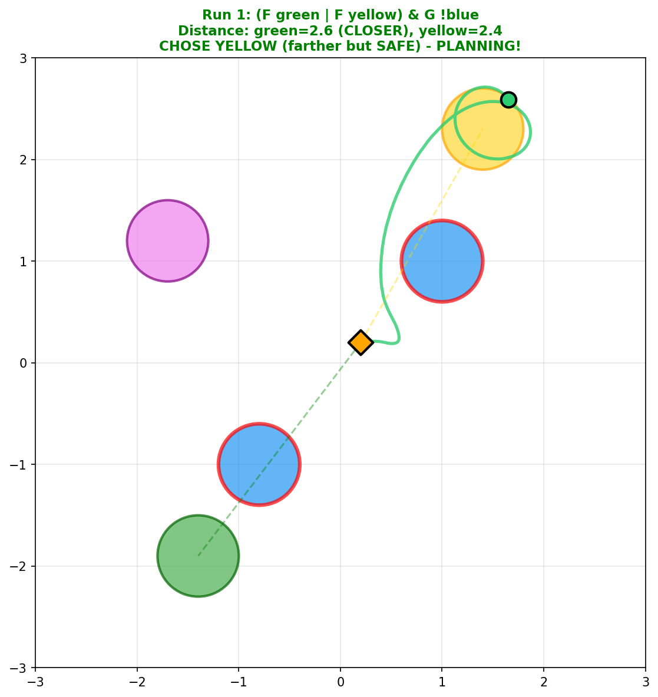
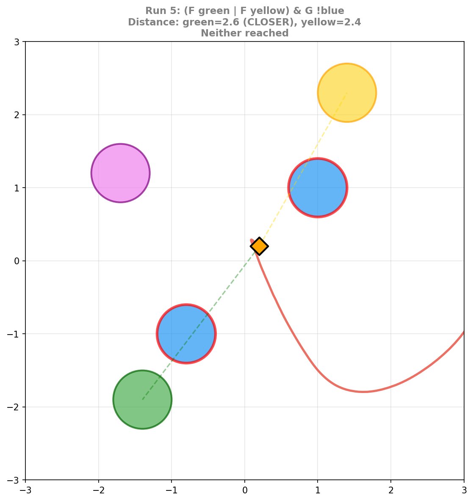

# World Model vs Behavioral Heuristics in DeepLTL

**Research Question**: Does the DeepLTL agent learn an internal world model for planning, or just behavioral heuristics that produce agent-like behavior without genuine multi-step reasoning?

## Executive Summary

| Planning Type | Task | Result |
|--------------|------|--------|
| **Local** (safety) | Choose unblocked goal | 80% correct |
| **Global** (optimality) | Choose path-minimizing intermediate | ~50% (random) |
| **Equidistant** (no myopic cue) | Choose when both intermediates same distance | ~50% (random) |

**Key Findings**:
1. The agent succeeds at local planning (pattern matching) but fails at global planning (requires world model)
2. On varied maps, agents show ~50% optimal choice - essentially random
3. When both intermediates are equidistant, choice is still ~50/50 - confirming the model relies on a "closest intermediate" heuristic, not path planning
4. The model does not encode chained distances (R² = 0.08-0.18), explaining why it cannot plan

---

## Background: Local vs Global Planning

| Planning Type | Definition | Example | Requires World Model? |
|--------------|------------|---------|----------------------|
| **Local** | Sequential navigation through goals | "Go to A, then B" | No - reactive heuristics sufficient |
| **Global** | Choosing between options based on downstream consequences | "Choose A1 or A2 based on which makes reaching B easier" | Yes - must simulate future states |

**Hypothesis**: If the agent has only behavioral heuristics (not a world model), it should succeed at local planning but fail at global planning.

---

## Experiment 1: Safety Planning (Local)

**Task**: `(F green | F yellow) & G !blue`
- Choose between green and yellow goals
- One goal is blocked by a blue zone (which must be avoided)
- Agent must detect the blocking and choose the unblocked goal

### Results: 80% Correct

The agent successfully identifies when a goal is blocked and redirects to the alternative. This works because blocking detection is **perceptual** - it's a pattern in the current observation (obstacle between agent and goal), not a simulation of future states.

**Success**: Agent detects green is blocked by blue zones, chooses yellow instead:

**Failure**: Agent fails to reach either goal:

---

## Experiment 2: Optimality Planning (Global)

**Task**: `F blue THEN F green`
- Must reach a blue zone first, then reach green
- Two blue zones available with different strategic values
- **Optimal choice**: Blue closer to green (minimizes total path)
- **Myopic choice**: Blue closer to agent (greedy)

### Results: ~50% Optimal, ~50% Myopic

| Model | Optimal | Myopic | Success |
|-------|---------|--------|---------|
| fresh_baseline | 50% | 50% | 93% |
| combined_aux02_trans01 | 49% | 51% | 75% |

The agent's choices are essentially **random** between optimal and myopic across varied map configurations.

*Green trajectories = optimal choice, orange = myopic choice*

**Why this fails**: Choosing optimally requires computing chained distances:
- d(agent → blue1) + d(blue1 → green) vs
- d(agent → blue2) + d(blue2 → green)

This requires simulating "if I go to blue1, where will I be, and how far to green from there?" - a world model capability the agent lacks.

---

## Experiment 3: Equidistant Optimality Test

**Question**: When the "myopic" cue (closer to agent) is removed, can the agent choose based on full path length?

**Setup**: Custom environment where both intermediate zones are placed at the **same distance** from the agent. The only way to choose optimally is to consider the full path to the goal.

### Results: Random Choice (~50/50)

| Model | Optimal | Suboptimal | Success |
|-------|---------|------------|---------|
| fresh_baseline | 54% | 46% | 93% |
| combined_aux02_trans01 | 53% | 45% | 78% |

When the "closest intermediate" heuristic cannot differentiate between options, **both agents choose at random**.

**Key Insight**: The model does NOT compute multi-step paths. It relies entirely on the myopic heuristic of "go to the nearest intermediate zone." When that cue is absent, it guesses.

---

## Experiment 4: Probing for Planning Representations

We trained linear probes to decode information from model activations during task execution.

### What the Agent Encodes

| Feature | R² | Interpretation |
|---------|-----|----------------|
| Distance to each zone | 0.74-0.93 | **Strong** - knows where things are |
| Blocking detection | 95% accuracy | **Strong** - explains safety success |
| Intermediate → Goal distance | 0.08-0.18 | **Weak** - doesn't compute |
| Total path via intermediate | 0.37-0.54 | **Weak** - no chained distances |

**Key Finding**: The model strongly encodes **immediate spatial features** (distances from self, blocking patterns) but weakly encodes **computed/relational features** (distances between other objects, chained path lengths).

---

## Conclusions

### 1. The Agent Has Heuristics, Not a World Model

| Capability | Result | Mechanism |
|------------|--------|-----------|
| Local planning (safety) | 80% success | Pattern recognition |
| Global planning (optimality) | ~50% (random) | Would require world model |
| Equidistant test | ~50% (random) | No planning, just guessing |

### 2. The ~50% "Optimal" Rate is Random

- Both baseline and auxiliary-trained agents show ~50% optimal choice
- When intermediates are equidistant (no myopic cue), choice is still ~50/50
- This is consistent with random selection, not partial planning ability

### 3. Probing Confirms Missing Representations

| Feature | R² Score |
|---------|----------|
| d_agent_to_int (observable) | 0.43-0.54 |
| d_int_to_goal (requires computation) | **0.08-0.18** |

The model does not encode the chained distances needed for optimal planning.

---

## Implications for Interpretability

1. **Planning is not emergent from task success**: Even when optimal planning would help, RL finds alternative solutions (myopic heuristics)
2. **Behavioral testing must control for confounds**: The ~50% "optimal" rate initially looked like partial planning, but equidistant testing reveals it's random
3. **The myopic heuristic is robust**: When both intermediates are equidistant, the agent doesn't fall back to planning - it just guesses

---

## Attempts to Induce Planning

We tested several approaches to induce planning behavior through training. See [PLANNING_INCENTIVES.md](PLANNING_INCENTIVES.md) for details.

**Summary**: None of the approaches (step penalty, auxiliary loss, transition prediction, or combined) improved actual planning behavior on varied maps, despite improving probe R² scores.

---

## Files Reference

### Analysis Scripts
| File | Purpose |
|------|---------|
| `analysis/optimality_test_clean.py` | Optimality test with varied maps/colors |
| `analysis/optimality_test_equidistant.py` | Equidistant optimality test |
| `analysis/preview_optvar_maps.py` | Preview optvar map layouts |
| `analysis/preview_opteq_maps.py` | Preview equidistant map layouts |

### Custom Environments
| File | Purpose |
|------|---------|
| `src/.../ltl_optimality_varied.py` | PointLtl2-v0.optvar environment |
| `src/.../ltl_optimality_equidistant.py` | PointLtl2-v0.opteq environment |

### Probing
| File | Purpose |
|------|---------|
| `probing/probe_planning_representations.py` | Linear probe analysis |
| `probing/probe_optvar_planning.py` | Probing on optvar environment |
