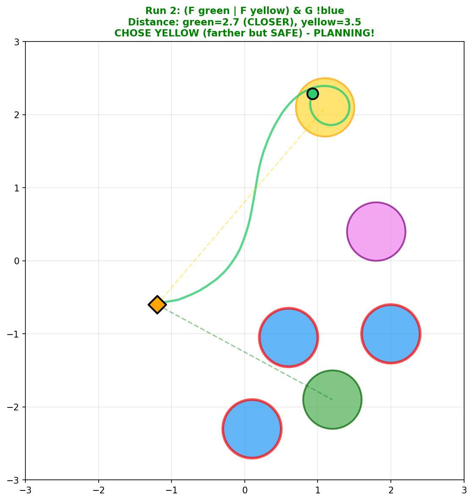
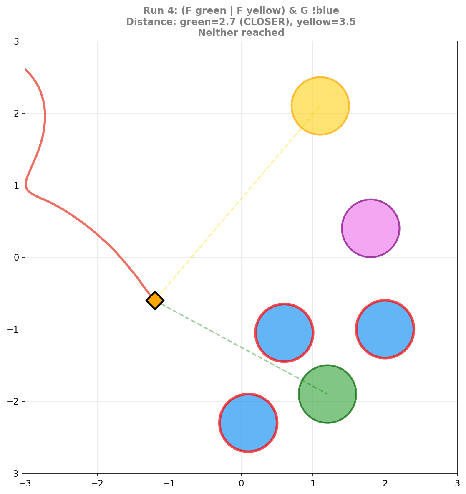

# Does DeepLTL Plan? A Summary

**Research Question**: Does the DeepLTL agent learn to plan, or does it just use reactive heuristics?

**Answer**: The agent uses **reactive heuristics**, not planning. It succeeds at tasks through pattern matching, not by reasoning about future consequences.

---

## Key Results at a Glance

| Test | Result | Interpretation |
|------|--------|----------------|
| Safety (avoid obstacles) | **80%** correct | Pattern recognition works |
| Optimality (choose better path) | **~50%** (random) | No multi-step reasoning |
| Equidistant (remove distance cue) | **~50%** (random) | Confirms no planning |
| Orientation bias analysis | **74%** forward | Prefers initial heading direction |
| Controlled orientation test | **58%** (not sig.) | Random when forward bias removed |
| Value function lookahead | **~50%** (random) | First-step dominated |

---

## 1. Safety Planning: Success (80%)

**Task**: Reach green OR yellow while avoiding blue

The agent can detect when a goal is blocked and choose the alternative. This works because it's **perceptual** - the obstacle is visible in the current observation.

| Success | Failure |
|:-------:|:-------:|
| Agent avoids blue, chooses yellow | Agent wanders, reaches neither |
|  |  |

---

## 2. Optimality Planning: Failure (~50%)

**Task**: Reach blue THEN reach green (two blue zones available)

The agent should choose the blue zone that minimizes total path length. Instead, it chooses essentially at random.

*Green = optimal choice, Orange = myopic choice. The agent shows no preference.*

### Empirical Difficulty Test

Using actual rollout difficulty (not geometric distance):

| Model | Chose Easier | 95% CI | Significant? |
|-------|-------------|--------|--------------|
| fresh_baseline | 68% | [54%, 79%] | Yes |
| combined_aux | 76% | [63%, 86%] | Yes |

The agent does show some preference for empirically easier paths, but this disappears when we control for distance (see below).

---

## 3. Equidistant Test: The Key Experiment (~50%)

**Setup**: Both intermediate zones at the **same distance** from the agent. The only way to choose correctly is to consider the full path to the goal.

| Model | Chose Optimal | 95% CI |
|-------|--------------|--------|
| fresh_baseline | 54% | [40%, 67%] |
| combined_aux | 53% | [39%, 66%] |

**Result**: When the "closest intermediate" cue is removed, the agent guesses randomly.

---

## 3.1 What About the 68% "Empirically Easier" Rate?

The ~68% rate seemed significant, but it's confounded by **orientation bias** (forward motion preference).

### The "Spatial Bias" is Actually Orientation Bias

| Model | LEFT/RIGHT Bias | Forward Preference |
|-------|-----------------|-------------------|
| fresh_baseline | 57% LEFT | **74%** forward (p < 0.0001) |

**Key finding**: The agent doesn't have a LEFT/RIGHT preference - it has a **forward motion** preference. It goes in the direction it's initially facing.

- When only one zone is forward (<90° from heading): agent chose it **79.5%** of the time
- The apparent "LEFT bias" is explained by initial heading distribution

### Controlled Orientation Test

When we control for forward bias by setting the agent to face the midpoint between zones:

| Model | Optimal Choice | 95% CI | Spatial Bias |
|-------|---------------|--------|--------------|
| fresh_baseline | **58.3%** | [48.3%, 67.7%] | 50%/50% L/R |

- Binomial test vs 50%: **p = 0.125** (NOT significant)
- Confidence interval **includes 50%** (random)
- Spatial bias **eliminated** when orientation controlled

**Conclusion**: The agent uses a forward motion heuristic. When this is controlled, it chooses essentially at random.

---

## 4. Probing: What Does the Model Encode?

Linear probes reveal what information is represented in the model's hidden states:

| Feature | R² | Verdict |
|---------|-----|---------|
| Distance to zones (from agent) | 0.74-0.93 | **Strong** |
| Blocking detection | 95% accuracy | **Strong** |
| Distance between zones | 0.08-0.18 | **Weak** |
| Total path via intermediate | 0.37-0.54 | **Weak** |

**Key insight**: The model encodes what it can *see* (distances from self), but not what it would need to *compute* (distances between other objects).

---

## 5. Value Function Analysis

Does the value function anticipate future difficulty?

| Test | Question | Result |
|------|----------|--------|
| A | Does V prefer easier full sequences? | 57% (weak correlation) |
| B | Does V anticipate when first step controlled? | **50%** (random) |
| C | Does suffix difficulty affect marginal V? | **ΔV ≈ 0** (no effect) |

**Conclusion**: The value function is **first-step dominated**. It doesn't anticipate the difficulty of future steps.

---

## 6. Did Training Interventions Help?

### Auxiliary Loss Approaches
We tried several approaches to induce planning:
- Step penalties
- Auxiliary loss (predict chained distances)
- Transition prediction loss
- Combined approaches

**Result**: Probe R² improved (0.315 → 0.405), but behavioral planning did NOT improve.

### Curriculum & Discount Interventions (Based on DeepLTL Author's Suggestions)

The DeepLTL author suggested that the baseline's high discount (0.998) makes return differences minimal, and starting with 1-step sequences biases toward "nearest zone" heuristics. We tested:

| Experiment | Discount | Curriculum | Task Success | Optimal Choice |
|------------|----------|------------|--------------|----------------|
| fresh_baseline | 0.998 | 1-step start | 91% | 58% (not sig.) |
| twostep_lowdiscount | 0.95 | 2-step only | 38% | - (too low success) |
| opt_d095_mixed | 0.95 | 75% 2-step + 25% 1-step | 64% | - |
| **opt_d099_mixed** | **0.99** | **mixed** | **85%** | **52%** (p=0.76) |

**Result**: The mixed curriculum with d=0.99 achieves near-baseline task success (85%), but shows **no improvement in planning** - 52% optimal choice is indistinguishable from random (p=0.764).

---

## Bottom Line

| Evidence | Supports Planning? |
|----------|-------------------|
| Safety task success (80%) | No - it's perceptual |
| Optimality task (~50%) | No - random |
| Equidistant test (~50%) | No - loses without distance cue |
| Orientation bias (74% forward) | No - forward motion heuristic |
| Controlled orientation (58%, not sig.) | No - random when bias removed |
| Probing (low R² for computed features) | No - missing representations |
| Value function (first-step dominated) | No - no lookahead |
| Auxiliary loss interventions | No - probe R² up but behavior unchanged |
| Curriculum/discount interventions | No - 52% optimal (p=0.76), still random |

**The DeepLTL agent succeeds through reactive heuristics, not planning.**

It follows sequential goals ("do A then B") but doesn't reason about which choice now will make future steps easier. When perceptual cues are available (blocking, closest zone), it uses them. When they're not, it falls back to a **forward motion heuristic** - preferring to go in the direction it's initially facing. When this bias is controlled, the agent chooses randomly.
