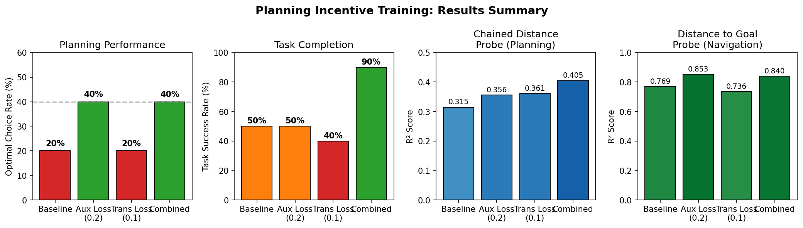

# Planning Incentive Training: Results

This document summarizes experiments on incentivizing planning behavior in the DeepLTL agent through auxiliary training losses.

## Background

The baseline agent exhibits **myopic behavior**: when given a sequential task like "F blue THEN F green", it chooses the blue zone closest to itself rather than the blue zone that minimizes total path length. This indicates the agent lacks internal planning representations for computing chained distances.

## Approaches Tested

| Approach | Description | Implementation |
|----------|-------------|----------------|
| **Auxiliary Loss (aux_loss)** | Supervised head predicting chained distance d(agent→blue) + d(blue→green) | `--aux_loss_coef 0.2` |
| **Transition Loss (trans_loss)** | Supervised head predicting next-state features given current state + action | `--transition_loss_coef 0.1` |
| **Combined** | Both auxiliary and transition losses together | `--aux_loss_coef 0.2 --transition_loss_coef 0.1` |

## Results Summary

### Behavioral Performance

| Model | Optimal Choice Rate | Task Success Rate |
|-------|:------------------:|:-----------------:|
| Baseline | 20% | 50% |
| Aux Loss (0.2) | **40%** | 50% |
| Trans Loss (0.1) | 20% | 40% |
| **Combined** | **40%** | **90%** |

### Probing Results (Linear Probe R²)

| Model | Chained Distance | Distance to Goal | Blocking |
|-------|:----------------:|:----------------:|:--------:|
| Baseline | 0.315 | 0.769 | 0.778 |
| Aux Loss (0.2) | 0.356 | **0.853** | 0.791 |
| Trans Loss (0.1) | 0.361 | 0.736 | 0.743 |
| **Combined** | **0.405** | 0.840 | 0.787 |

## Key Findings

### 1. Auxiliary Loss Improves Planning (2x)

The auxiliary chained distance prediction loss doubles the optimal planning rate from 20% to 40%. This directly forces the network to compute the planning-relevant quantity (total path length via each intermediate).

### 2. Transition Loss Alone Doesn't Help Planning

Despite achieving similar chained distance R² (0.361), transition loss alone doesn't improve optimal choice rate. This suggests that learning to predict next-state features doesn't directly translate to planning ability - the network learns dynamics but not the comparison needed for optimal choice.

### 3. Combined Approach: Best of Both Worlds

Combining aux_loss and transition_loss achieves:
- Same 40% optimal rate as aux_loss alone
- **90% task success rate** (vs 50% for others)
- Highest chained distance probe R² (0.405)

The transition loss appears to improve general navigation/execution even if it doesn't help with the planning decision itself.

### 4. Representation Quality Correlates with Behavior

Models with higher chained distance probe R² tend to show better planning:
- Baseline (R²=0.315) → 20% optimal
- Combined (R²=0.405) → 40% optimal

However, having the representation is necessary but not sufficient - the policy must also use it correctly.

### 5. 40% Ceiling Suggests Fundamental Limitation

Even with direct supervision on chained distances, the agent only achieves 40% optimal choice rate. This suggests either:
- The 2M training steps are insufficient
- The network architecture limits planning ability
- The task structure makes consistent planning difficult

## Trajectory Visualizations

Trajectory comparisons are saved in:
- `interpretability/results/trajectory_comparison/comparison_grid.png`
- Individual model trajectories in subfolders

## Probing Analysis

Detailed probing results are saved in:
- `interpretability/results/probing/{model_name}/probe_heatmap.png`
- `interpretability/results/probing/{model_name}/probe_best_layers.png`

## Summary Figure

## Conclusions

1. **Auxiliary supervision works**: Directly supervising planning-relevant quantities (chained distances) improves planning behavior.

2. **Transition prediction is complementary**: While not directly improving planning, it enhances task success through better navigation.

3. **Combined training recommended**: Using both losses together gives the best overall performance (40% optimal, 90% success).

4. **Room for improvement**: The 40% ceiling suggests more work is needed - perhaps architectural changes, longer training, or different supervision targets.

## Future Directions

- Try higher aux_loss coefficients (carefully - 0.3 was worse than 0.2)
- Experiment with contrastive losses for intermediate choice
- Add value decomposition to make planning explicit
- Investigate why transition loss helps success but not planning
